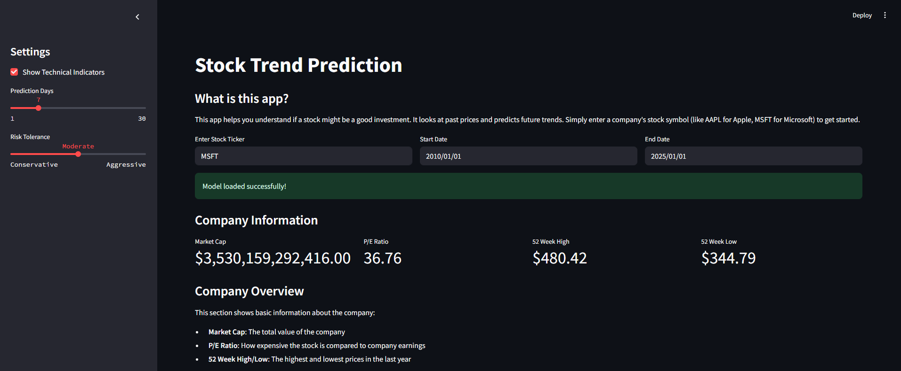
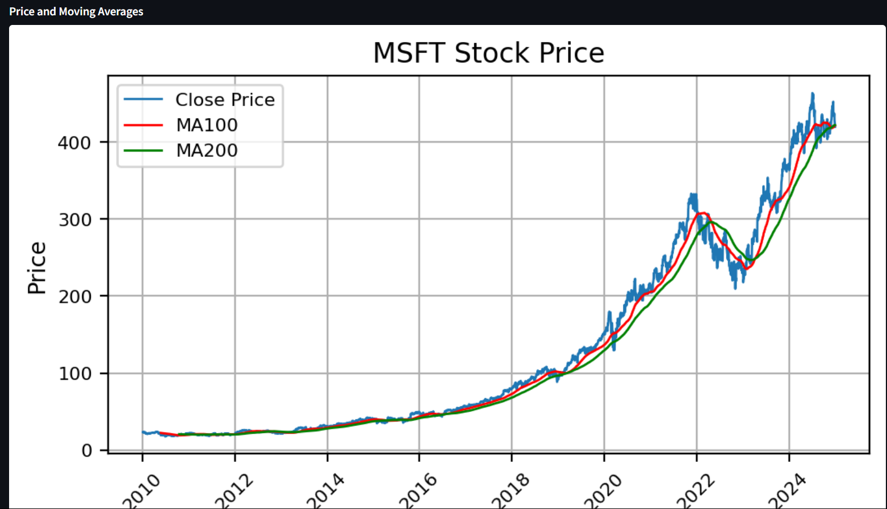
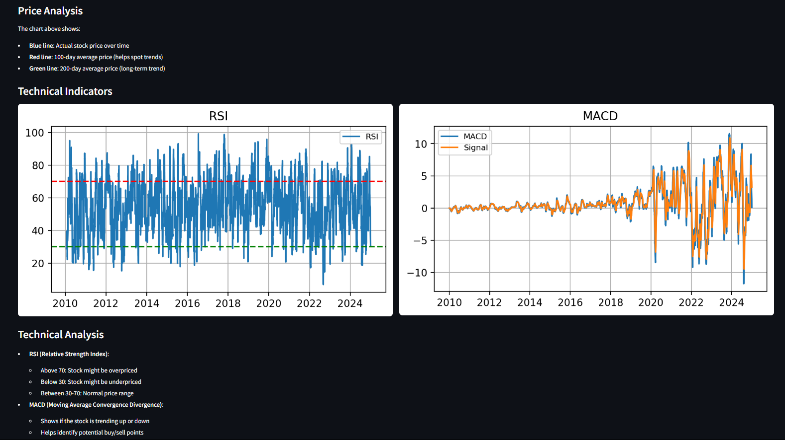
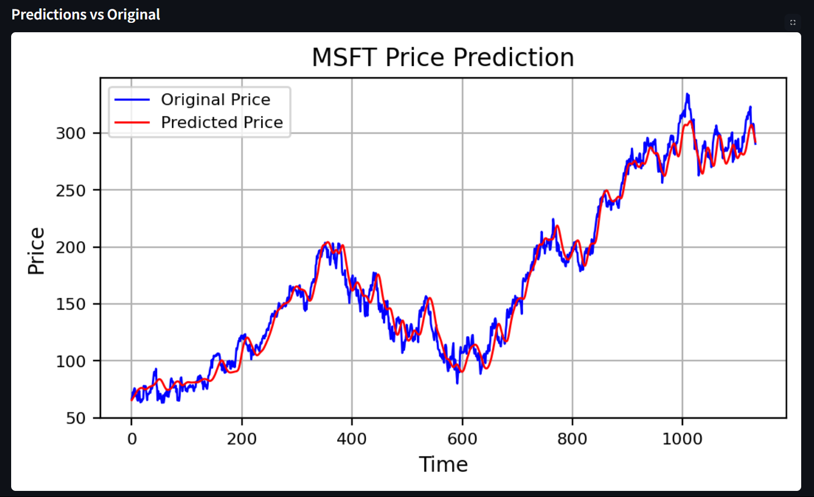
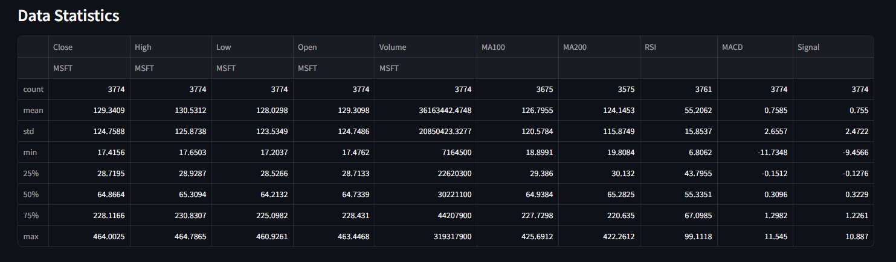
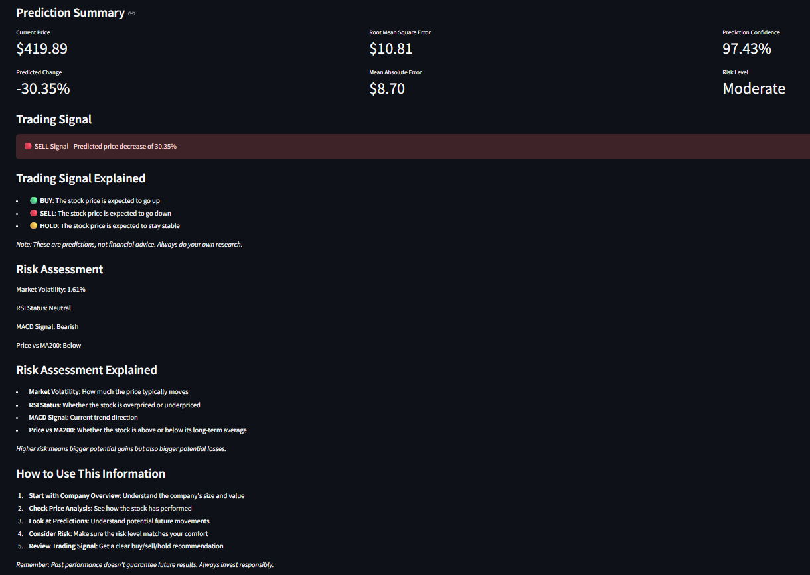

# Stock Trend Prediction

A machine learning application that predicts stock price trends using LSTM (Long Short-Term Memory) neural networks. The application provides technical analysis, price predictions, and trading signals based on historical stock data.

## Features

- Real-time stock data fetching using Yahoo Finance API
- Technical indicators (RSI, MACD, Moving Averages)
- Price trend predictions using LSTM model
- Trading signals with customizable risk tolerance
- Interactive visualizations
- Risk assessment metrics

## Screenshots

### Dashboard Overview

*Main dashboard showing stock analysis and predictions*

### Moving Averages

*Price chart with moving averages*

### Technical Analysis

*RSI and MACD technical indicators*

### Price Predictions

*LSTM model predictions vs actual prices*

### Data Statistics

*Statistical analysis of stock data*

### Prediction Summary

*Price predictions and trading signals summary*

## Setup

1. Clone the repository:
```bash
git clone <repository-url>
cd stock-trend-prediction
```

2. Create and activate a virtual environment:
```bash
python -m venv venv
source venv/bin/activate  # On Windows: venv\Scripts\activate
```

3. Install dependencies:
```bash
pip install -r requirements.txt
```

4. Run the application:
```bash
streamlit run app.py
```

## Usage

1. Enter a stock ticker symbol (e.g., AAPL, MSFT, GOOGL)
2. Select date range for analysis
3. Adjust settings in the sidebar:
   - Show/hide technical indicators
   - Set prediction days
   - Choose risk tolerance level

## Model Details

The prediction model uses a deep LSTM architecture with:
- 4 LSTM layers with dropout
- 100-day sequence input
- Mean Squared Error loss function
- Adam optimizer

> **Note:** Currently, the model only analyzes closing price trends. Future enhancements may include additional features such as opening prices, high/low values, and trading volume to improve prediction accuracy.

## Dependencies

- Python 3.8+
- TensorFlow
- Streamlit
- yfinance
- pandas
- numpy
- matplotlib
- scikit-learn

## License

MIT License

## Disclaimer

This application is for educational purposes only. The predictions and trading signals should not be used as financial advice. Always do your own research before making investment decisions.